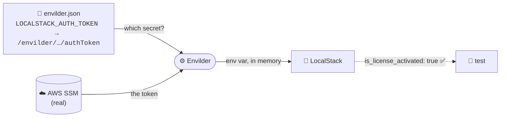
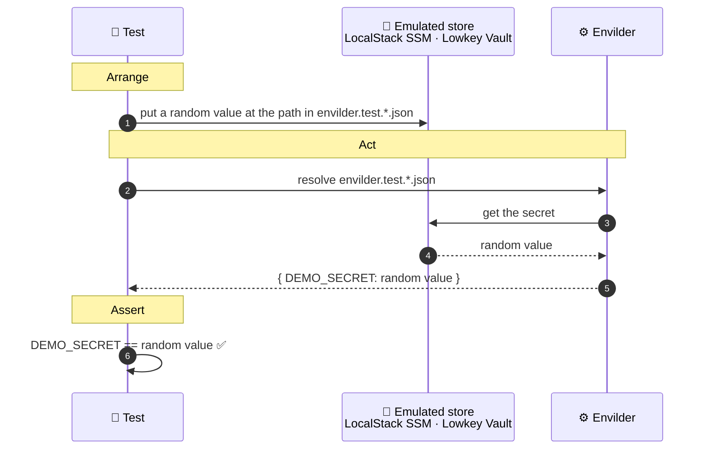

# Envilder Examples

How much code does it take to feed a secret from AWS SSM into a LocalStack container, with nothing on disk and nothing committed?

This much:

```typescript
const env = await Envilder.resolveFile('envilder.json');

const localstack = await new LocalstackContainer('localstack/localstack:stable')
  .withEnvironment(Object.fromEntries(env))
  .start();
```

Plus one committed file that maps names to paths. Paths, not values, so it's safe in Git:

```json
{
  "LOCALSTACK_AUTH_TOKEN": "/envilder/development/localstack/authToken"
}
```

That's the entire integration. [Envilder](https://envilder.com) resolves the token from your cloud at runtime: SSM → memory → container. No `.env`, no export, no bash script per stack. This repo shows it in five setups, for **AWS SSM** and **Azure Key Vault**.

## What the tests prove

Every example tells the same two stories.

### 1. Envilder hands your containers their secrets

LocalStack refuses to start its Pro features without an auth token. Envilder fetches it from your **real** AWS account and passes it straight into the container:



Test: `Should_ActivateLicense_When_…StartsLocalStackWithTokenResolvedByEnvilder`. It passes only if Envilder found the real token and LocalStack accepted it.

### 2. Envilder turns a map file into environment variables

The same test, once per cloud. It stores a random value where the map file points, asks Envilder to resolve the map file, and checks that the value matches:



Tests: `Should_ResolveSecretFromSsm_When_MapFilePointsToIt` and `Should_ResolveSecretFromKeyVault_When_MapFilePointsToIt`. A fresh random value on every run means a pass can only come from what Envilder just read.

> **The one line that differs from production.** In your app you write `Env.ResolveFileAsync("envilder.json")` and Envilder builds the cloud client for you. The tests build that client themselves, aimed at the emulator, and pass it to `EnvilderClient`. Everything after that line is the exact code your app runs.

## The examples

| Folder | Stack | Run it (from the folder) |
|--------|-------|--------|
| [`typescript-testcontainers/`](./typescript-testcontainers) | Vitest + Testcontainers | `npm install && npm test` |
| [`python-testcontainers/`](./python-testcontainers) | pytest + Testcontainers (uv) | `uv run pytest` |
| [`dotnet-testcontainers/`](./dotnet-testcontainers) | xUnit v3 + Testcontainers | `dotnet test` |
| [`dotnet-aspire/`](./dotnet-aspire) | Aspire AppHost + `Aspire.Hosting.Testing` | `cd AppHost.Tests && dotnet test` |
| [`typescript-aspire/`](./typescript-aspire) | Aspire [TypeScript AppHost](https://devblogs.microsoft.com/aspire/aspire-typescript-apphost/) | `npm install && npm test` * |

Each folder has its own README with the order to read its files in. Each folder is self-contained: there is no `package.json` at the repo root, so run the command inside the folder. The two .NET examples also share a solution, so `dotnet test` from the repo root runs both.

Testcontainers and Aspire are alternative orchestrators; pick the folder that matches your project. (Aspire AppHosts can also orchestrate [Python](https://aspire.dev/integrations/frameworks/python/) and JavaScript apps.)

\* Needs the [Aspire CLI](https://aspire.dev) 13.5+. There's no TypeScript `Aspire.Hosting.Testing` yet, so the tests spawn `aspire run` and wait for the emulators to answer. The first run generates `.modules/` and `.aspire/` (both git-ignored).

### The map files

All examples share the map files at the repo root:

| File | Maps | Points at |
|------|------|-----------|
| [`envilder.json`](./envilder.json) | `LOCALSTACK_AUTH_TOKEN` | your **real** AWS SSM or Azure Key Vault ([options](#store-your-localstack-token-once)) |
| [`envilder.test.aws.json`](./envilder.test.aws.json) | `DEMO_SECRET` → an SSM path | LocalStack's SSM |
| [`envilder.test.azure.json`](./envilder.test.azure.json) | `DEMO_SECRET` → a Key Vault secret name | Lowkey Vault |

The two `test` files only differ in `$config.provider` and in the shape of the identifier: SSM uses paths (`/a/b`), Key Vault uses names (`a-b`).

### The emulators

| Cloud | Emulator | Needs |
|-------|----------|-------|
| AWS SSM | [LocalStack](https://localstack.cloud) | an auth token (fetched by Envilder, see story 1) |
| Azure Key Vault | [Lowkey Vault](https://github.com/nagyesta/lowkey-vault) | nothing: free and offline |

Lowkey Vault serves HTTPS with a self-signed certificate and hands out fake Azure tokens on a second port. Each folder's README lists the few lines that deal with that. You won't need them against real Azure.

## Before you run (once)

Install only what the folders you want need:

| Tool | Version | Used by |
|------|---------|---------|
| [Docker](https://www.docker.com/) | any recent | all |
| [Node.js](https://nodejs.org/) | 24 LTS or newer (see [`.nvmrc`](./.nvmrc)) | `typescript-*` |
| [uv](https://docs.astral.sh/uv/) | any recent; it installs Python 3.14 for you | `python-testcontainers` |
| [.NET SDK](https://dotnet.microsoft.com/download) | 10.0 (see [`global.json`](./global.json)) | `dotnet-*` |
| [Aspire CLI](https://aspire.dev/get-started/install-cli/) | 13.5+ | `typescript-aspire` |

### Store your LocalStack token (once)

You need a [LocalStack auth token](https://docs.localstack.cloud/aws/getting-started/auth-token/) in your own cloud. Envilder resolves it from AWS SSM or Azure Key Vault: pick one, write the matching [`envilder.json`](./envilder.json), and push the token with one command.

#### Option A: AWS SSM Parameter Store (default)

Needs AWS credentials in `~/.aws/credentials`.

```json
{
  "LOCALSTACK_AUTH_TOKEN": "/envilder/development/localstack/authToken"
}
```

```bash
npx envilder --push \
  --key=LOCALSTACK_AUTH_TOKEN \
  --value=<your-token> \
  --secret-path=/envilder/development/localstack/authToken
```

Using a named AWS profile? Add it to `$config`, and Envilder uses it for both the push and the tests:

```json
{
  "$config": { "provider": "aws", "profile": "my-profile" },
  "LOCALSTACK_AUTH_TOKEN": "/envilder/development/localstack/authToken"
}
```

#### Option B: Azure Key Vault

Needs an Azure login (`az login`) with permission to read and write secrets in your vault. Key Vault secret names allow only letters, digits and dashes, so the identifier is a name, not a path:

```json
{
  "$config": {
    "provider": "azure",
    "vaultUrl": "https://<your-vault>.vault.azure.net"
  },
  "LOCALSTACK_AUTH_TOKEN": "localstack-auth-token"
}
```

```bash
npx envilder --push \
  --key=LOCALSTACK_AUTH_TOKEN \
  --value=<your-token> \
  --secret-path=localstack-auth-token
```

Run the push from the repo root: the CLI reads `$config` from `envilder.json` and sends the token to your vault.

Nothing else changes. The tests and AppHosts call `Envilder.resolveFile('envilder.json')`, and the `$config` block decides where the token comes from. See [providers](https://envilder.com/#providers).

On Apple Silicon or Windows on ARM, Lowkey Vault runs under amd64 emulation and takes about 40 s to start. The tests wait for it.

## Updating dependencies

Versions are pinned in one place per ecosystem, so an upgrade is one command each:

| Ecosystem | Where versions live | Upgrade |
|-----------|---------------------|---------|
| .NET | [`Directory.Packages.props`](./Directory.Packages.props) (NuGet), [`global.json`](./global.json) (SDK + `Aspire.AppHost.Sdk`) | `dotnet outdated envilder-examples.slnx -u` ([dotnet-outdated](https://github.com/dotnet-outdated/dotnet-outdated)) |
| Python | [`pyproject.toml`](./python-testcontainers/pyproject.toml) + `uv.lock` | `uv lock --upgrade` |
| Node | each folder's `package.json` + `package-lock.json` | `npx npm-check-updates -u && npm install` |
| Aspire (TypeScript) | [`aspire.config.json`](./typescript-aspire/aspire.config.json) | `aspire update`, then delete `.modules/` so it regenerates |

When you bump Aspire, update the `Aspire.AppHost.Sdk` version in `global.json` and `Aspire.Hosting.Testing` in `Directory.Packages.props` together.

## Links

- [Envilder](https://github.com/macalbert/envilder) · [envilder.com](https://envilder.com)
- Blog: [Envilder + Testcontainers + LocalStack: integration tests that fetch their own secrets](https://dev.to/macalbert)
