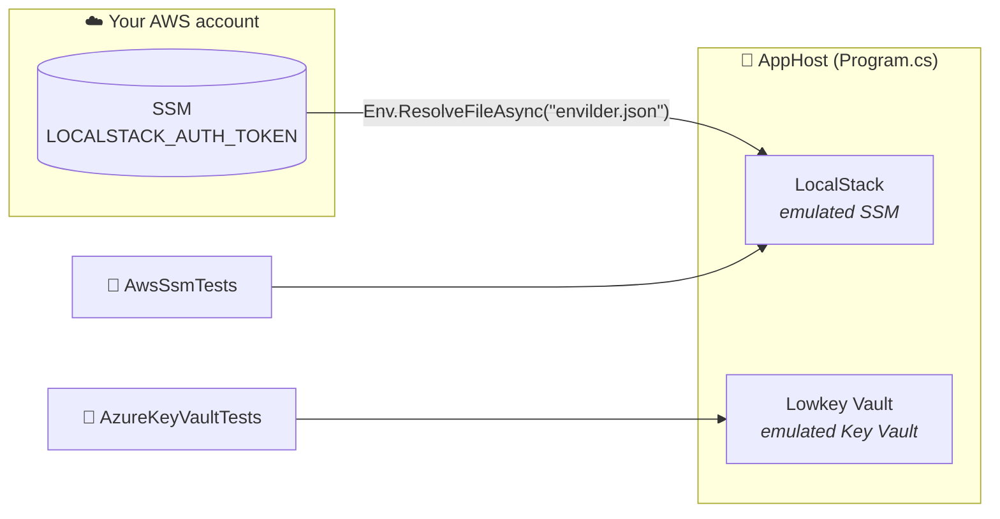

# .NET + Aspire

**Aspire AppHost · `Aspire.Hosting.Testing` · xUnit v3 · LocalStack · Lowkey Vault**

```bash
cd AppHost.Tests && dotnet test
```

Or run the AppHost alone with `dotnet run --project AppHost` and watch both emulators in the Aspire dashboard.

> **Before you run:** [`envilder.json`](../envilder.json) maps `LOCALSTACK_AUTH_TOKEN` to the SSM key `/envilder/development/localstack/authToken`, so that key must hold your LocalStack token in your AWS account, and you need the [AWS CLI](https://aws.amazon.com/cli/) installed and logged in (`aws configure` or `aws sso login`). See [Store your LocalStack token](../README.md#store-your-localstack-token-once).

## What happens when you run it



The tests boot the real AppHost once (`AspireAppFixture`), wait until both emulators are healthy, and run against them:

| Test | Proves |
|------|--------|
| `Should_ActivateLicense_When_AppHostStartsLocalStackWithTokenResolvedByEnvilder` | Envilder fetched the real token and LocalStack accepted it |
| `Should_ResolveSecretFromSsm_When_MapFilePointsToIt` | Envilder resolves `envilder.test.aws.json` against SSM |
| `Should_ResolveSecretFromKeyVault_When_MapFilePointsToIt` | Envilder resolves `envilder.test.azure.json` against Key Vault |

## Read the code in this order

1. **[`AppHost/Program.cs`](./AppHost/Program.cs)** shows the whole integration: a `foreach` over `Env.ResolveFileAsync("envilder.json")` that calls `localstack.WithEnvironment(key, value)`. Lowkey Vault sits next to it and needs no token.
2. **[`AppHost.Tests/AwsSsmTests.cs`](./AppHost.Tests/AwsSsmTests.cs)** holds the first two tests. In the second, look at the `Act` block: that is everything Envilder does.
3. **[`AppHost.Tests/AzureKeyVaultTests.cs`](./AppHost.Tests/AzureKeyVaultTests.cs)** is the same test against Key Vault. Only the map file and the client change.
4. **[`AppHost.Tests/AspireAppFixture.cs`](./AppHost.Tests/AspireAppFixture.cs)** starts the AppHost and builds clients aimed at the emulators. Skim it.

## The line to look at

Your app resolves a map file in one call, and Envilder builds the cloud client for you:

```csharp
var secrets = await Env.ResolveFileAsync("envilder.test.aws.json");
```

The tests need that client aimed at an emulator, so they build it themselves and hand it to Envilder:

```csharp
var sut = new EnvilderClient(new AwsSsmSecretProvider(app.Ssm));
var secrets = await sut.ResolveSecretsAsync(mapFile);
```

Everything after that line is the same code your app runs.

## Emulator-only bits

You won't need these against real clouds:

| Where | What | Why |
|-------|------|-----|
| `Program.cs` | `WithHttpHealthCheck("/ping", endpointName: "token")` | lets Aspire know when Lowkey Vault is ready |
| `AspireAppFixture` | `BasicAWSCredentials("test", "test")` | LocalStack accepts any credentials |
| `AspireAppFixture` | `IDENTITY_ENDPOINT` / `IDENTITY_HEADER` | `DefaultAzureCredential` gets its token from Lowkey Vault, as it would from Azure on an App Service |
| `AspireAppFixture` | `DangerousAcceptAnyServerCertificateValidator` | Lowkey Vault uses a self-signed certificate |
| `AspireAppFixture` | `DisableChallengeResourceVerification` | the vault isn't on `*.vault.azure.net` |
