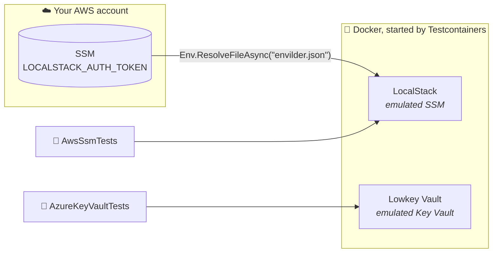

# .NET + Testcontainers

**xUnit v3 · Testcontainers · LocalStack · Lowkey Vault**

```bash
dotnet test
```

## What happens when you run it



Three tests, two stories (see the [root README](../README.md#what-the-tests-prove)):

| Test | Proves |
|------|--------|
| `Should_ActivateLicense_When_LocalStackStartsWithTokenResolvedByEnvilder` | Envilder fetched the real token and LocalStack accepted it |
| `Should_ResolveSecretFromSsm_When_MapFilePointsToIt` | Envilder resolves `envilder.test.aws.json` against SSM |
| `Should_ResolveSecretFromKeyVault_When_MapFilePointsToIt` | Envilder resolves `envilder.test.azure.json` against Key Vault |

## Read the code in this order

1. **[`LocalStackFixture.cs`](./LocalStackFixture.cs)** shows the whole integration in two statements: `Env.ResolveFileAsync("envilder.json")`, then `.WithEnvironment(secrets)`.
2. **[`AwsSsmTests.cs`](./AwsSsmTests.cs)** holds the first two tests. In the second, look at the `Act` block: that is everything Envilder does.
3. **[`AzureKeyVaultTests.cs`](./AzureKeyVaultTests.cs)** is the same test against Key Vault. Compare it with the SSM one: only the map file and the client change.
4. **[`LowkeyVaultFixture.cs`](./LowkeyVaultFixture.cs)** is emulator plumbing. Skim it.

## The line to look at

Your app resolves a map file in one call, and Envilder builds the cloud client for you:

```csharp
var secrets = await Env.ResolveFileAsync("envilder.test.aws.json");
```

The tests need that client aimed at an emulator, so they build it themselves and hand it to Envilder:

```csharp
var envilder = new EnvilderClient(new AwsSsmSecretProvider(localStack.Ssm));
var secrets = await envilder.ResolveSecretsAsync(mapFile);
```

Everything after that line is the same code your app runs.

## Emulator-only bits

You won't need these against real clouds:

| Where | What | Why |
|-------|------|-----|
| `LocalStackFixture` | `BasicAWSCredentials("test", "test")` | LocalStack accepts any credentials |
| `LowkeyVaultFixture` | `IDENTITY_ENDPOINT` / `IDENTITY_HEADER` | `DefaultAzureCredential` gets its token from Lowkey Vault, as it would from Azure on an App Service |
| `LowkeyVaultFixture` | `DangerousAcceptAnyServerCertificateValidator` | Lowkey Vault uses a self-signed certificate |
| `LowkeyVaultFixture` | `DisableChallengeResourceVerification` | the vault isn't on `*.vault.azure.net` |
