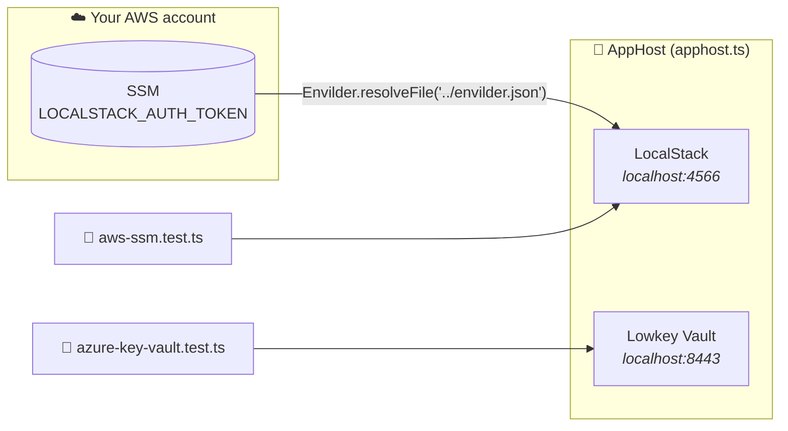

# TypeScript + Aspire

**Aspire [TypeScript AppHost](https://devblogs.microsoft.com/aspire/aspire-typescript-apphost/) · Vitest · LocalStack · Lowkey Vault**

```bash
npm install && npm test
```

Needs the [Aspire CLI](https://aspire.dev/get-started/install-cli/) 13.5+. Or run the AppHost alone with `aspire run` and watch both emulators in the Aspire dashboard.

## What happens when you run it



There's no TypeScript `Aspire.Hosting.Testing` yet. Instead, [`aspire.setup.ts`](./aspire.setup.ts) runs `aspire run` once for the whole test run, waits until both emulators answer, and stops it at the end.

| Test | Proves |
|------|--------|
| `Should_ActivateLicense_When_AspireStartsLocalStackWithTokenResolvedByEnvilder` | Envilder fetched the real token and LocalStack accepted it |
| `Should_ResolveSecretFromSsm_When_MapFilePointsToIt` | Envilder resolves `envilder.test.aws.json` against SSM |
| `Should_ResolveSecretFromKeyVault_When_MapFilePointsToIt` | Envilder resolves `envilder.test.azure.json` against Key Vault |

## Read the code in this order

1. **[`apphost.ts`](./apphost.ts)** shows the whole integration: `Envilder.resolveFile('../envilder.json')`, then `.withEnvironment('LOCALSTACK_AUTH_TOKEN', token)`. Lowkey Vault sits next to it and needs no token.
2. **[`aws-ssm.test.ts`](./aws-ssm.test.ts)** holds the first two tests. In the second, look at the `Act` block: that is everything Envilder does.
3. **[`azure-key-vault.test.ts`](./azure-key-vault.test.ts)** is the same test against Key Vault. Only the map file and the client change.
4. **[`aspire.setup.ts`](./aspire.setup.ts)** starts and stops the AppHost. Skim it.

## The line to look at

Your app resolves a map file in one call, and Envilder builds the cloud client for you:

```typescript
const secrets = await Envilder.resolveFile('envilder.test.aws.json');
```

The tests need that client aimed at an emulator, so they build it themselves and hand it to Envilder:

```typescript
const envilder = new EnvilderClient(new AwsSsmSecretProvider(ssm));
const secrets = await envilder.resolveSecrets(mapFile);
```

Everything after that line is the same code your app runs.

## Emulator-only bits

You won't need these against real clouds:

| Where | What | Why |
|-------|------|-----|
| `apphost.ts` | `withHttpHealthCheck({ path: '/ping', … })` | lets Aspire know when Lowkey Vault is ready |
| `aws-ssm.test.ts` | `credentials: { accessKeyId: 'test', … }` | LocalStack accepts any credentials |
| `azure-key-vault.test.ts` | `IDENTITY_ENDPOINT` / `IDENTITY_HEADER` | `DefaultAzureCredential` gets its token from Lowkey Vault, as it would from Azure on an App Service |
| `azure-key-vault.test.ts` | `NODE_TLS_REJECT_UNAUTHORIZED = '0'` | Lowkey Vault uses a self-signed certificate (Node prints a warning about it, which is expected) |
| `azure-key-vault.test.ts` | `disableChallengeResourceVerification` | the vault isn't on `*.vault.azure.net` |

The first run generates `.modules/` and `.aspire/` (both git-ignored).
