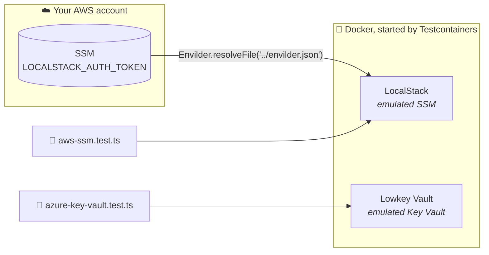

# TypeScript + Testcontainers

**Vitest · Testcontainers · LocalStack · Lowkey Vault**

```bash
npm install && npm test
```

> **Before you run:** [`envilder.json`](../envilder.json) maps `LOCALSTACK_AUTH_TOKEN` to the SSM key `/envilder/development/localstack/authToken`, so that key must hold your LocalStack token in your AWS account, and you need the [AWS CLI](https://aws.amazon.com/cli/) installed and logged in (`aws configure` or `aws sso login`). See [Store your LocalStack token](../README.md#store-your-localstack-token-once).

## What happens when you run it



Three tests, two stories (see the [root README](../README.md#what-the-tests-prove)):

| Test | Proves |
|------|--------|
| `Should_ActivateLicense_When_LocalStackStartsWithTokenResolvedByEnvilder` | Envilder fetched the real token and LocalStack accepted it |
| `Should_ResolveSecretFromSsm_When_MapFilePointsToIt` | Envilder resolves `envilder.test.aws.json` against SSM |
| `Should_ResolveSecretFromKeyVault_When_MapFilePointsToIt` | Envilder resolves `envilder.test.azure.json` against Key Vault |

## Read the code in this order

1. **[`aws-ssm.test.ts`](./aws-ssm.test.ts)**: the `beforeAll` is the whole integration in two statements, `Envilder.resolveFile(...)` and `.withEnvironment(...)`. Then come the first two tests. In the second, look at the `Act` block: that is everything Envilder does.
2. **[`azure-key-vault.test.ts`](./azure-key-vault.test.ts)** is the same test against Key Vault. Its `beforeAll` is emulator plumbing, so skim it. The test itself only changes the map file and the client.

## The line to look at

Your app resolves a map file in one call, and Envilder builds the cloud client for you:

```typescript
const secrets = await Envilder.resolveFile('envilder.test.aws.json');
```

The tests need that client aimed at an emulator, so they build it themselves and hand it to Envilder:

```typescript
const sut = new EnvilderClient(new AwsSsmSecretProvider(ssm));
const secrets = await sut.resolveSecrets(mapFile);
```

Everything after that line is the same code your app runs.

## Emulator-only bits

You won't need these against real clouds:

| What | Why |
|------|-----|
| `credentials: { accessKeyId: 'test', … }` | LocalStack accepts any credentials |
| `IDENTITY_ENDPOINT` / `IDENTITY_HEADER` | `DefaultAzureCredential` gets its token from Lowkey Vault, as it would from Azure on an App Service |
| `agent: new Agent({ rejectUnauthorized: false })` | Lowkey Vault uses a self-signed certificate; only this client skips the check |
| `disableChallengeResourceVerification` | the vault isn't on `*.vault.azure.net` |
